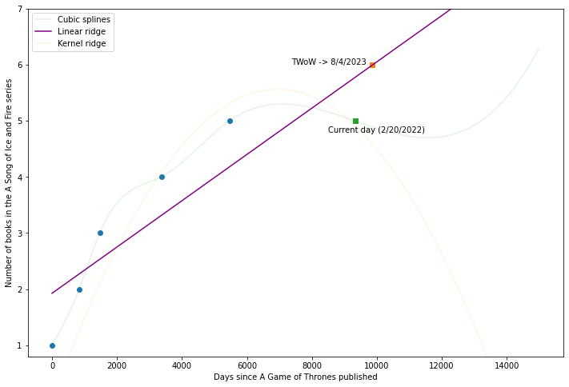

## Release date predictor

This is just a goofy project of mine to work on some regression work. I saw a Reddit thread where someone used a third degree polynomial to predict when the last two ASOIAF books are going to be released. Even though the curve seemed to be a good fit,  there were a few comments criticizing it, saying that a good fit does not imply a good 'regression', and that a straight line fit would be better. This is not necessarily true and an erroneous simplification. Ultimately, the more degrees a polynomial fit has the more likely it is to overfit; this is true. However, the quality of fit does matter. This is why assessing fits with AIC and BIC is important, and with that, I'm going to try and tackle some of these predictions with hopefully a more justified curve for a bit of fun. There are not meant to be hard-and-fast predictions, as most of these will have a relatively low number of datapoints to train the regressor on. 

I ended up getting a prediction date for August of 2023 using some ridge regression.

Things I may try and find predictors on besides tWoW and ADoS:

- When the next Marvel movie will come out (of a franchise or just any Marvel film)
- When the next Batman/Superman/X franchies comes out